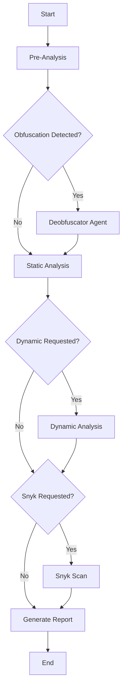

# Commit Detection - NPM Malware Analysis

A comprehensive security analysis tool for NPM packages that combines pre-analysis, static analysis (LLM-based), dynamic analysis (sandboxed), and deobfuscation to detect malicious commits.

## 🚀 Features

### 🔍 Analysis Pipeline
1.  **Pre-Analysis**:
    *   Analyzes repository metadata and contributor trust scores.
    *   Detects sensitive file modifications (startup scripts, package.json).
    *   Identifies suspicious change patterns and large commits.

2.  **🛡️ Deobfuscation (New)**:
    *   **Detection**: Automatically detects obfuscated code using heuristics and LLM.
    *   **Deobfuscation**: Uses `javascript-deobfuscator` to reverse common obfuscation techniques (array rotation, string encoding, etc.).
    *   **Refinement**: Uses an LLM to rename variables and restore readability before static analysis.

3.  **🧠 Static Analysis**:
    *   Uses OpenAI LLMs (GPT-4o, etc.) to detect vulnerability patterns.
    *   Detects code injection, suspicious network calls, crypto-mining, and data exfiltration.
    *   Analyzes code contextually, even across large diffs.

4.  **📦 Dynamic Analysis**:
    *   Runs the package in a secure, sandboxed environment (Vagrant/VirtualBox).
    *   Monitors runtime behavior, network traffic, and file system changes.
    *   safe execution of potentially malicious code.

5.  **🔎 Snyk Integration**:
    *   Optional integration with Snyk to scan for known vulnerabilities in dependencies.

### 📊 Reporting
-   Generates detailed Markdown and JSON reports.
-   Provides severity levels and actionable recommendations.

## 🛠️ Installation

1.  **Clone the repository**:
    ```bash
    git clone https://github.com/JakeClark-chan/npm_commit_detection.git
    cd npm_commit_detection/commit_detection
    ```

2.  **Install dependencies**:
    ```bash
    uv pip install -e .
    ```

3.  **Install external tools** (for Dynamic Analysis & Deobfuscation):
    *   **Node.js & npm**: Required for deobfuscation tools.
    *   **Vagrant & VirtualBox**: Required for dynamic analysis sandbox.
    *   **fzf**: Required for TUI mode.

## ⚙️ Configuration

Create a `.env` file in the `commit_detection` directory:

```env
# Required: OpenAI API
OPENAI_API_KEY=your_openai_api_key
OPENAI_BASE_URL=https://api.openai.com/v1/

# LLM Configuration
LLM_MODEL=gpt-4o-mini
LLM_CONTEXT_WINDOW=128000

# Deobfuscation (Enabled by default)
DEOBFUSCATION_ENABLED=true
DEOBFUSCATION_MODEL=gpt-4o-mini

# Dynamic Analysis (Optional)
VAGRANT_CWD=../vagrant_sandbox  # Path to Vagrantfile

# Optional: LangSmith Tracing
LANGSMITH_API_KEY=your_langsmith_api_key
LANGSMITH_TRACING_V2=true
LANGSMITH_PROJECT=commit-detection
```

## 🖥️ Usage

### Interactive TUI Mode
Run without arguments to enter the Terminal User Interface:
```bash
python main.py
```
*Requires `fzf` installed.*

### Command Line Mode
Run with arguments for automated analysis:

```bash
python main.py <repo_path> <version_tag> [previous_tag] [options]
```

#### Arguments:
-   `repo_path`: Path to the local git repository to analyze.
-   `version_tag`: The target version/tag to analyze (end of range).
-   `previous_tag`: (Optional) The starting version/tag. If omitted, analyzes just the target.

#### Options:
-   `--dynamic <commit_hash>`: Run dynamic analysis on a specific commit.
-   `--snyk`: Enable Snyk dependency scanning.
-   `--skip-dynamic`: Skip the dynamic analysis phase.

### Examples

**Analyze a specific version range:**
```bash
python main.py ../mongoose 8.19.1 8.19.0
```

**Analyze with Dynamic Analysis:**
```bash
python main.py ../mongoose 8.19.1 8.19.0 --dynamic a1b2c3d
```

**Analyze with Snyk:**
```bash
python main.py ../mongoose 8.19.1 --snyk
```

## 🏗️ Architecture

The tool is built using **LangGraph** to orchestrate the analysis workflow:



## 🤝 Contributing

1.  **Run Tests**: `pytest test_*.py`
2.  **Linting**: `ruff check .`

## 📄 License

MIT
